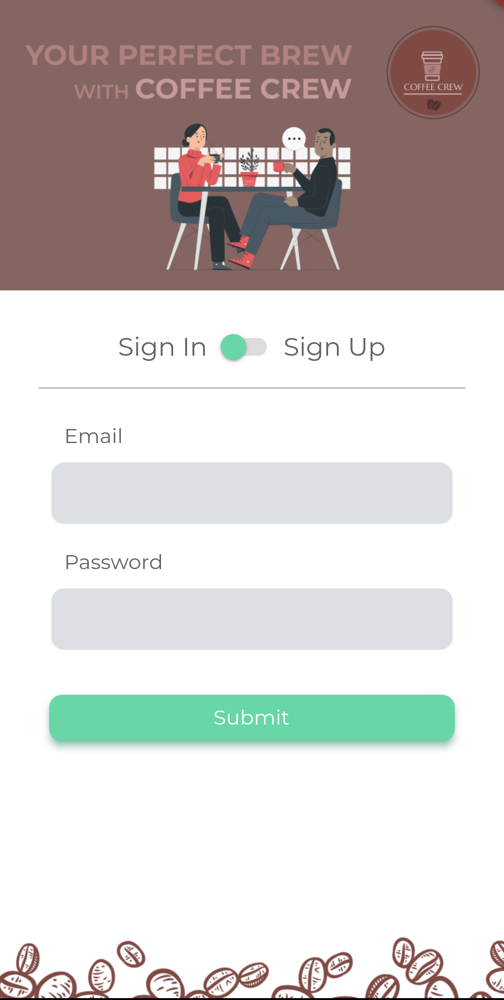
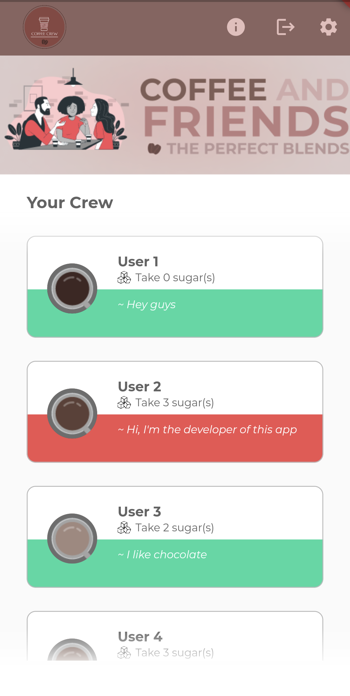
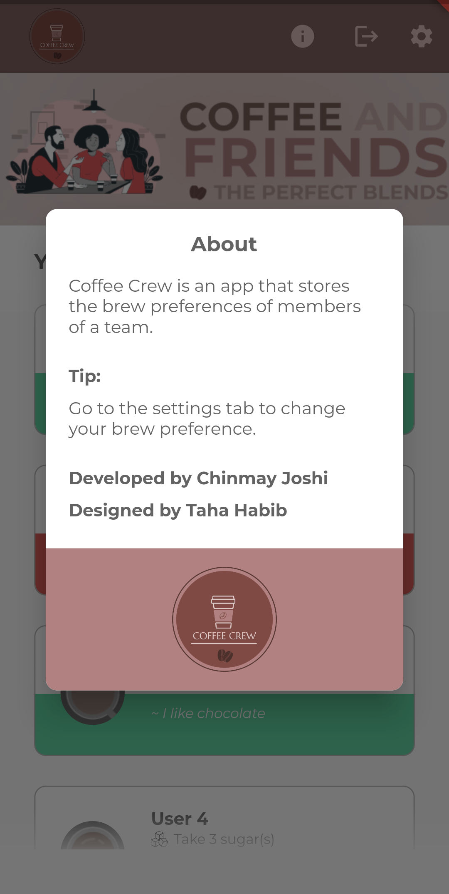
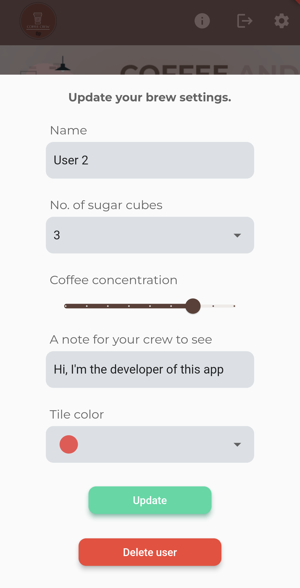

# Coffee Crew 

Coffee Crew is an app that stores the brew preferences of members of a team in a database. Any new member or user can register and set their preference and later change it as well if they want in the settings panel. Everytime the user signs in, they can view their brew preference as well as their team members'.
The project was made using Flutter and uses cloud firestore database to store data.

<table>
  <tr>
    <td></td>
    <td></td>
    <td></td>
    <td></td>
  </tr>
 </table>
